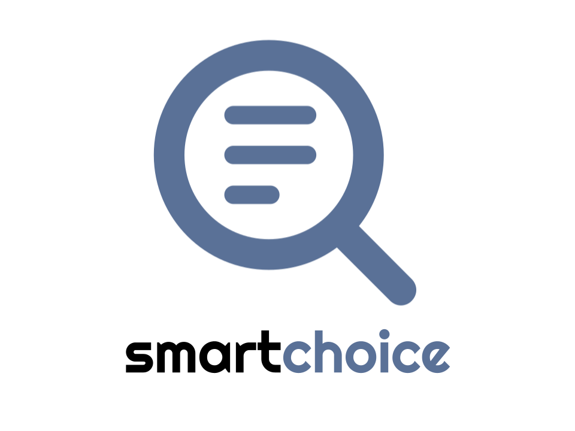

# smartchoice
Xfinity SmartChoice

SmartChoice is a machine learning-powered software that simplifies the selection process for companies with large product offerings, delivering simple, personalized recommendations that boosts conversion rates, drive higher sales, and maximize revenue through smart upsells and blended plan options.

